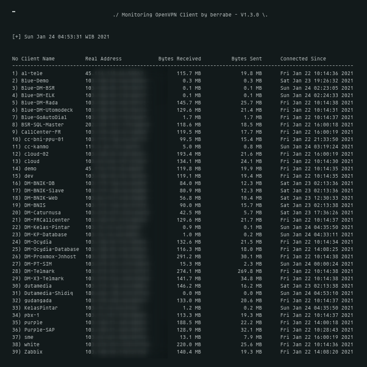
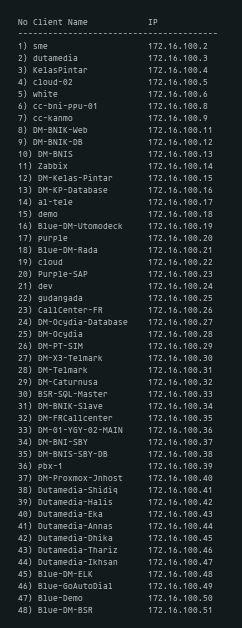

<p align="center">
  
</p>

<br/><br/>
### TLDR;
---
This simple script is made on top of the bash shell, used to monitor OpenVPN Network built with [angristan automation script](https://github.com/angristan/openvpn-install)

In essence, there are 2 features :
1. **monitoring mode**, which will see all clients connected to the OpenVPN server, including the number of bytes sent / received, and the last time connected to the OpenVPN network ... the source of the information is from the `/var/log/openvpn/status.log` file
2. **ip mode**, to list all of static IPs used by clients ... the source of the information is from the `/etc/openvpn/ipp.txt` file

<br/>

:warning: **Note** : run this script on OpenVPN Server, not on OpenVPN client / Agent

<br/><br/>
### USAGE
---
- first step, clone this repo

```sh
> git clone https://github.com/berrabe/monitoring-openvpn.git
> cd monitoring-openvpn
> chmod +x openvpn_mon.brb
```


- then, for **monitoring mode** you have to exec this command

```sh
> ./openvpn_mon.brb mon
```

- and, for **ip mode** you have to exec this command

```sh
> ./openvpn_mon.brb ip
```


<br/><br/>
### POC
---
Here are some examples pics from this monitoring script

- Monitoring Mode
<p align="center">
  
</p>


- IP Mode
<p align="center">
  
</p>